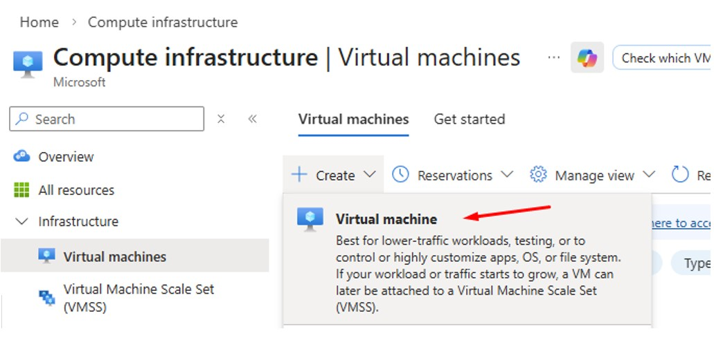
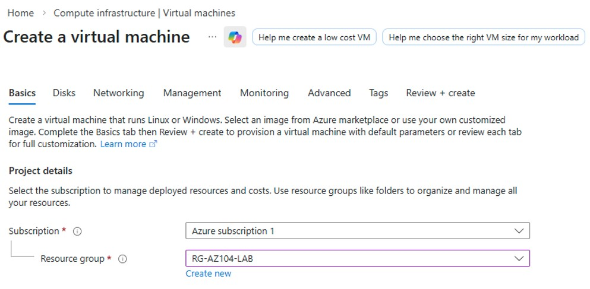
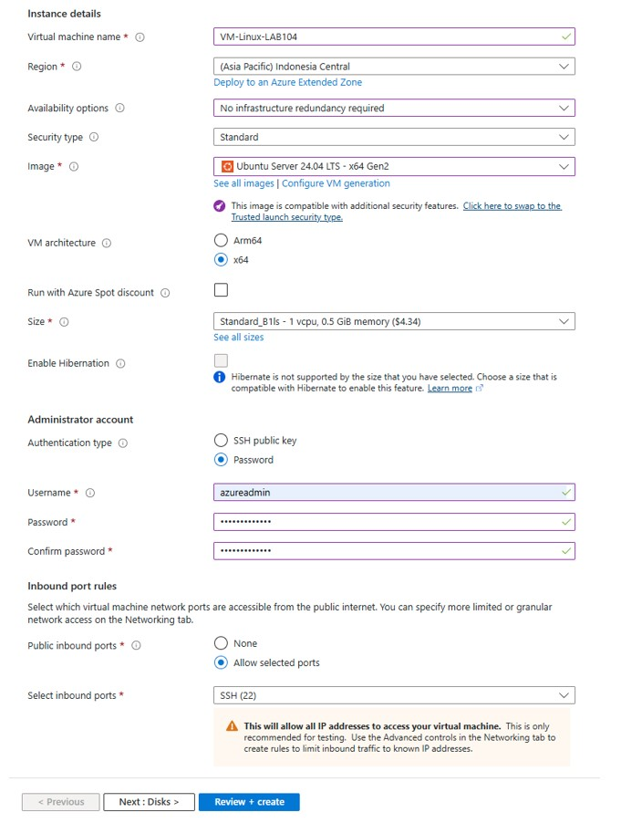
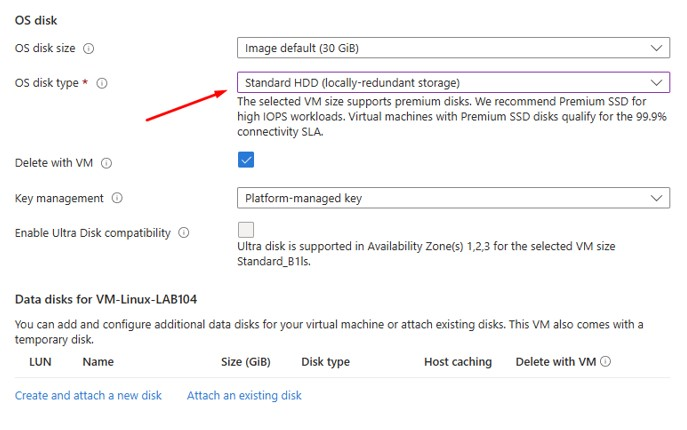
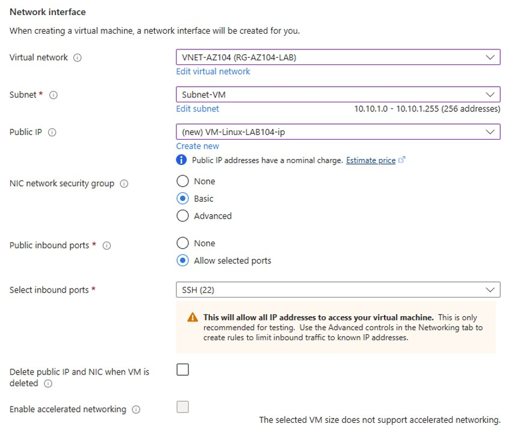
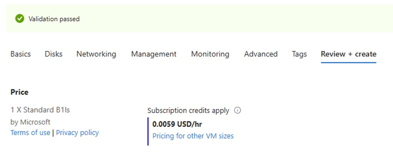
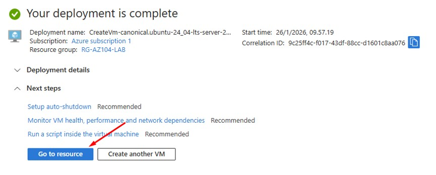
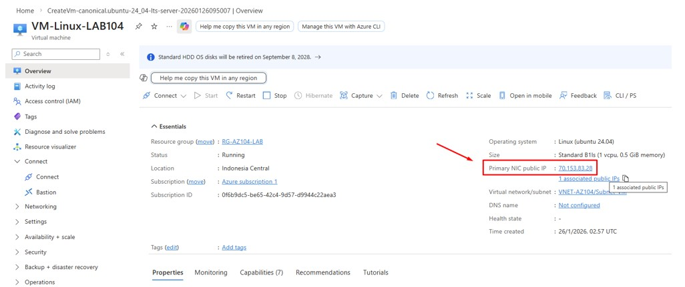
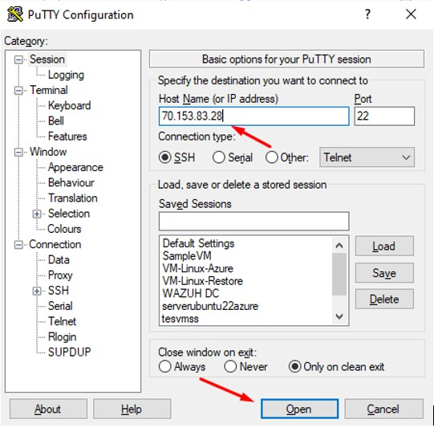
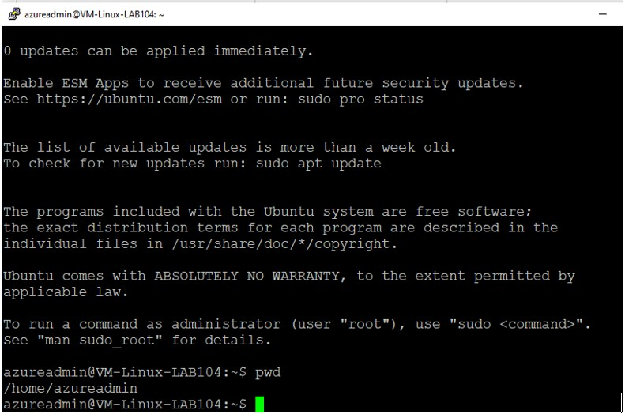

# 🚀 Day 1 — Azure VM with Public IP

---

## 🎯 Objective
Create config NSG rule for ICMP Traffic

---

## 🛠 Lab Tasks
- Allow ICMP Traffic
- Deny ICMP Traffic

---

## 🧠 Key Concept

- NSG attached on NIC vs Subnet
- Rule Priority

---

## 🏗 Step 1 — Create Linux VM
### Azure Portal → Virtual Machines → Create VM

### Select Resource Group

### Select Disk

### For NSG we can create and choose basic or use the existing one

### Create and review

### Result

---

## 🔐 Step 2 — Access VM using Public IP
### Azure Portal → Virtual Machines → Overview

### Use Putty or other toll to access VM via SSH

### Result

> Allow inbound SSH (Port 22) from your public IP.

---

## ✅ Validation

Successfully apply allow and deny traffic from ICMP

---

## 💡 Lessons Learned

- By default NGS not allowed ICMP
- NSG is mandatory for inbound and outbound access
- NSG like firewall
