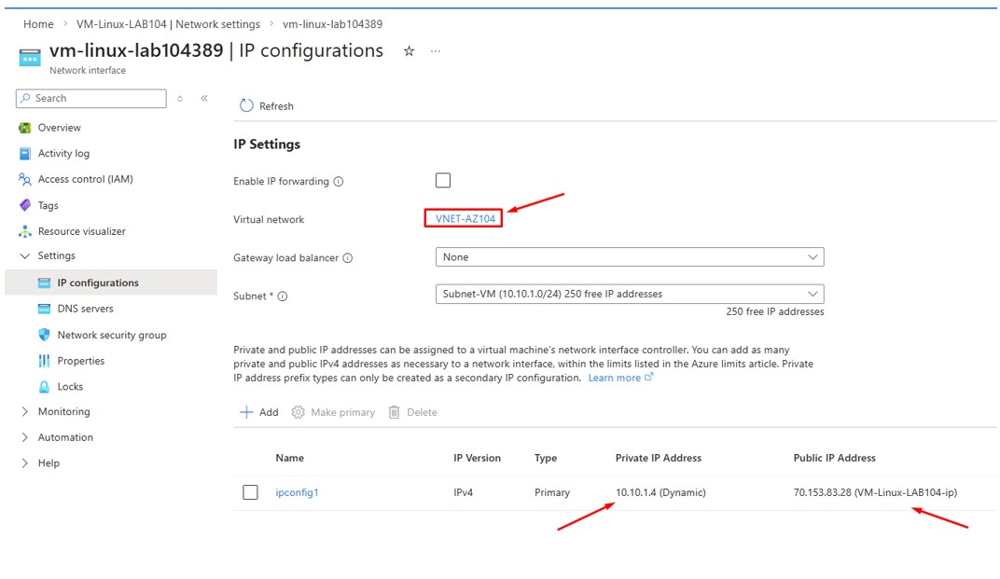
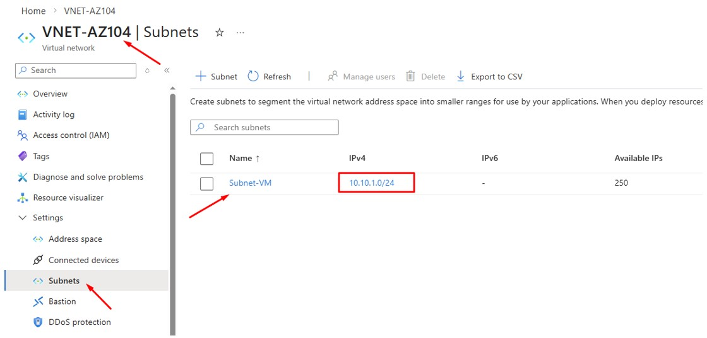
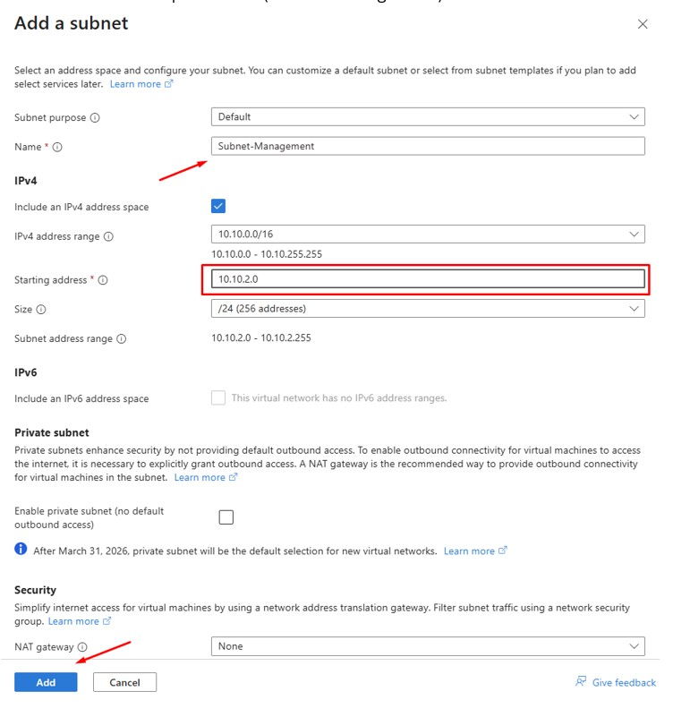
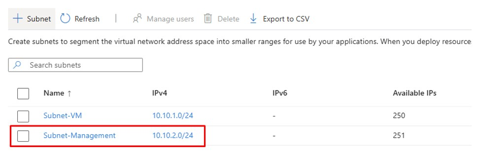
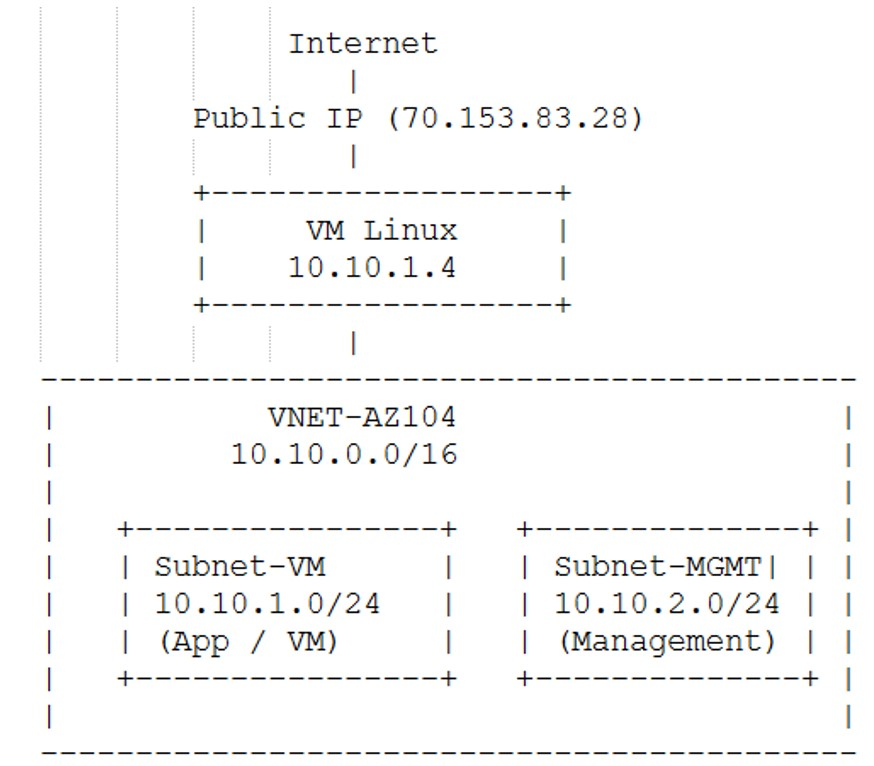

# 🚀 Day 3 — Azure Virtual Network (VNet)

---

## 🎯 Objective
Understand Azure Virtual Network (VNet) concept by analyzing IP addressing and subnet configuration.

---

## 🛠 Lab Tasks
- Check VM private IP address
- Match VM IP with VNet address space
- Create new subnet inside VNet

---

## 🧠 Key Concept

- VNet = Virtual network in Azure
- Works like a **network segment / VLAN** in on-prem
- Subnet = smaller network inside VNet
- IP address of VM must belong to VNet range

---

## 🏗 Step 1 — Check VM IP Address

### Azure Portal → Virtual Machine → Networking

> Verify private IP assigned to VM

---

## 🏗 Step 2 — Check VNet & Subnet

### Azure Portal → Virtual Network

> Ensure VM IP is within VNet address space and subnet range

---

## 🏗 Step 3 — Create New Subnet

### Azure Portal → VNet → Subnets → Add Subnet

> Create additional subnet for network segmentation

---

## 📊 Result

> New subnet successfully created and visible in VNet

---

## 🏗 Step 4 — VNet Topology Overview

> Visualization of VNet, Subnet, and VM placement

---

## ✅ Validation

- VM IP matches VNet address space
- Subnet successfully created
- Network structure clearly defined

---

## 🏢 Real-World Mapping

| Azure Component | On-Prem Equivalent |
|----------------|-------------------|
| VNet           | VLAN / Network Segment |
| Subnet         | Subnetting |
| Private IP     | Internal IP |

---

## 💡 Lessons Learned

- VNet is the foundation of Azure networking
- Every VM must belong to a subnet inside a VNet
- Proper subnet design is important for scalability
