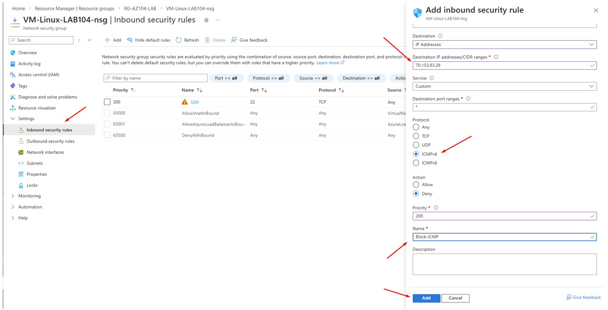
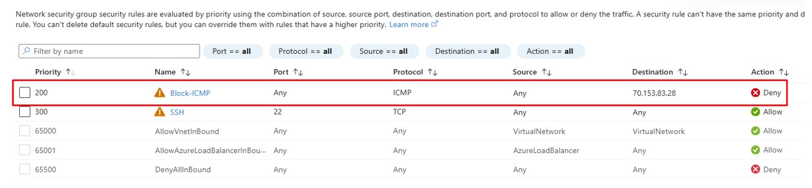
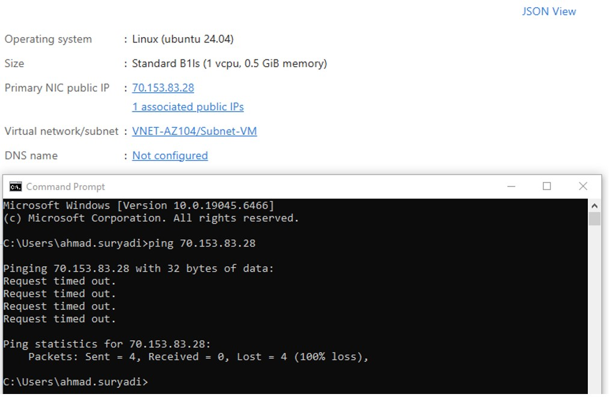
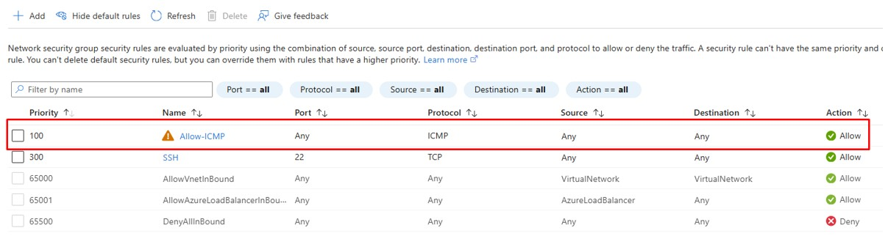
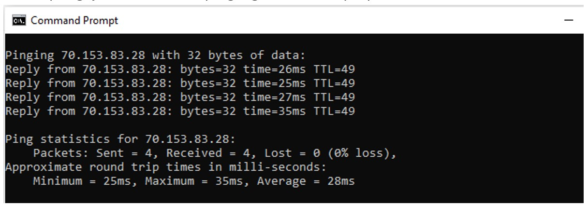

# 🚀 Day 3 — Virtual Network (VNET)

---

## 🎯 Objective
Create config NSG rule for ICMP Traffic

---

## 🛠 Lab Tasks
- Allow ICMP Traffic
- Deny ICMP Traffic

---

## 🧠 Key Concept

- Allow = Permit traffic through to destination
- Deny = Drop traffic through to destination
- Rule Priority

---

## 🏗 Step 1 — NSG rule (ICMP Block)
> By default no ICMP rule allow on NSG it mean not able ping to VM, otherwise we can create this rule manually
### Azure Portal → Virtual Machines → Inbound security rules

### Result

### Testing rule

---

## 🏗 Step 2 — NSG rule (ICMP Allow)
### Azure Portal → Virtual Machines → Inbound security rules

### Testing rule

---

## ✅ Validation

Successfully apply allow and deny traffic from ICMP

---

## 💡 Lessons Learned

- By default NGS not allowed ICMP
- NSG is mandatory for inbound and outbound access
- NSG like firewall
