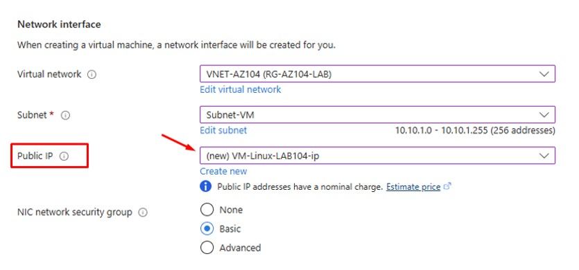
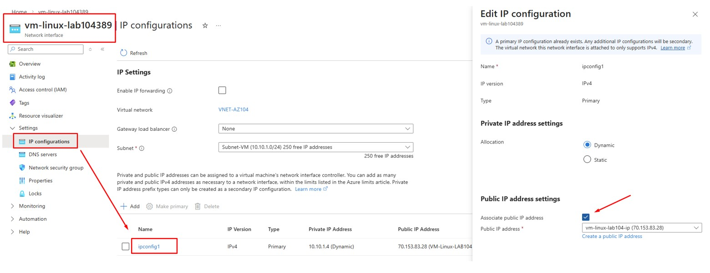

# 🚀 Day 4 — Azure VM Without Public IP

---

## 🎯 Objective
Deploy a Virtual Machine without a public IP and verify that it cannot be accessed directly from the internet.

---

## 🛠 Lab Tasks
- Create new VM without Public IP
- Remove Public IP from existing VM (optional)
- Test connectivity (Ping / SSH should fail)

---

## 🧠 Key Concept

- Public IP is required for direct internet access
- Without Public IP → VM is private (internal only)
- Azure follows **secure-by-default design**

---

## 🏗 Step 1 — Create VM Without Public IP

### Azure Portal → Create Virtual Machine → Networking

- Set **Public IP = None**

> VM is deployed without any internet exposure

---

## 🏗 Step 2 — Remove Public IP from Existing VM

### Azure Portal → VM → Networking → Network Interface

- Detach / uncheck Public IP from NIC

> VM becomes private after removing public IP

---

## 🚫 Testing Connectivity

- Ping from internet → ❌ Failed  
- SSH from internet → ❌ Failed  

> VM is not reachable without Public IP

---

## ✅ Validation

- VM cannot be accessed from internet
- No Public IP assigned to VM
- Access only possible from internal network (VNet)

---

## 🏢 Real-World Mapping

| Azure Component | On-Prem Equivalent |
|----------------|-------------------|
| No Public IP   | Private Server (LAN only) |
| VNet           | Internal Network |
| NSG            | Internal Firewall |

---

## 💡 Lessons Learned

- Azure is secure by default
- Public IP must be explicitly assigned
- Best practice: avoid Public IP for production workloads
