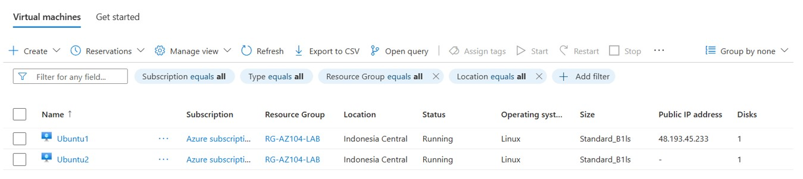
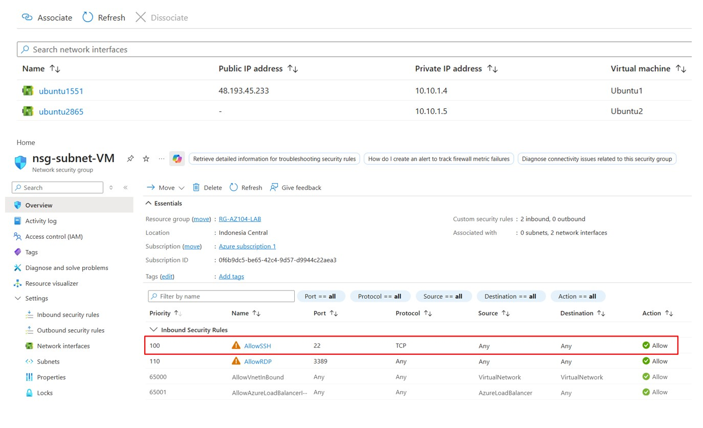
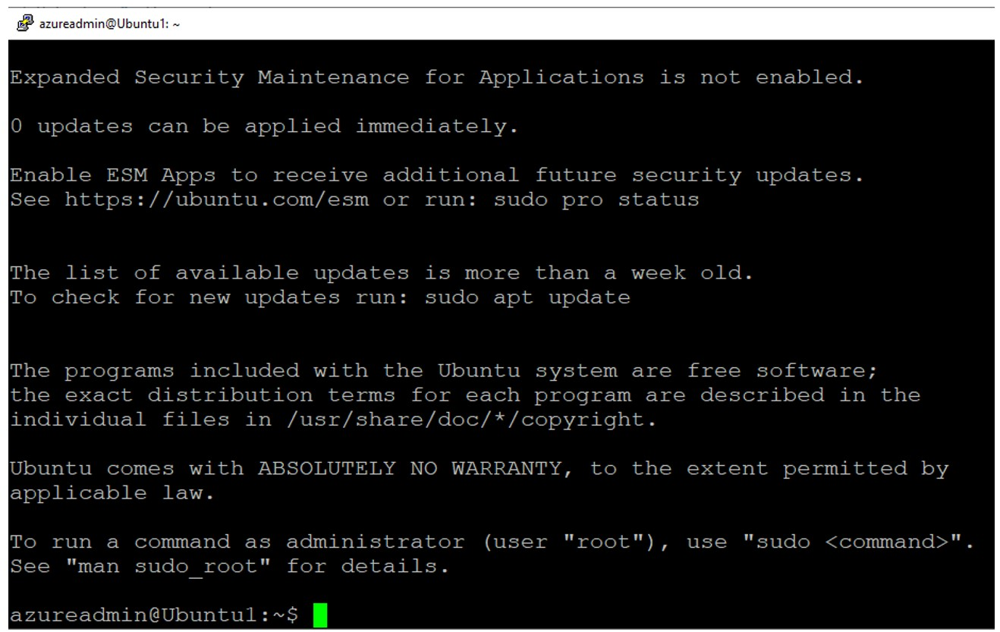

# 🚀 Day 5 — Azure Jumpbox Concept

---

## 🎯 Objective
Access a private VM through a public VM using SSH (Jumpbox concept).

---

## 🛠 Lab Tasks
- Deploy 2 Virtual Machines:
  - VM A (Jumpbox) → with Public IP
  - VM B → private only (no Public IP)
- Configure NSG to allow SSH (Port 22)
- Access VM B from VM A using SSH

---

## 🧠 Key Concept

- Jumpbox = intermediary VM to access private resources
- Private VM should not be exposed directly to internet
- Access flow:

  **User → Public VM (Jumpbox) → Private VM**

- This concept is commonly replaced by Azure Bastion

---

## 🏗 Step 1 — Prepare Two VMs

- VM A → with Public IP (Jumpbox)
- VM B → without Public IP (Private VM)



> VM A will act as entry point to access VM B

---

## 🔐 Step 2 — Configure NSG Rule

- Allow inbound SSH (Port 22) to VM A
- Ensure VM B allows SSH from internal network



> NSG must allow SSH traffic between VMs

---

## 🌐 Step 3 — SSH to Jumpbox (VM A)

From your local machine:

```bash
ssh azureadmin@<public-ip-vm-a>

> Successfully connected to Jumpbox VM
