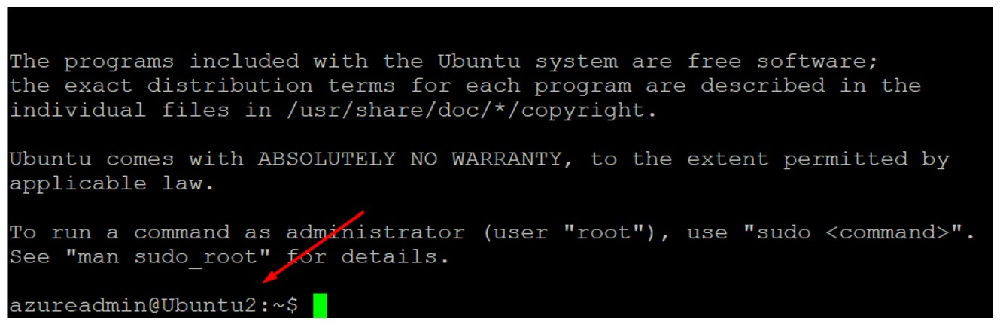

# 🚀 Day 5 — Azure Jumpbox Concept

---

## 🎯 Objective
Access a private VM through a public VM using SSH (Jumpbox concept).

---

## 🛠 Lab Tasks
- Deploy 2 Virtual Machines:
  - VM A (Jumpbox) → with Public IP
  - VM B → private only (no Public IP)
- Configure NSG to allow SSH (Port 22)
- Access VM B from VM A using SSH

---

## 🧠 Key Concept

- Jumpbox = intermediary VM to access private resources
- Private VM should not be exposed directly to internet
- Access flow:

  **User → Public VM (Jumpbox) → Private VM**

- This concept is commonly replaced by Azure Bastion

---

## 🏗 Step 1 — Prepare Two VMs

- VM A → with Public IP (Jumpbox)
- VM B → without Public IP (Private VM)

> VM A will act as entry point to access VM B

---

## 🔐 Step 2 — Configure NSG Rule

- Allow inbound SSH (Port 22) to VM A
- Ensure VM B allows SSH from internal network

> NSG must allow SSH traffic between VMs

---

## 🌐 Step 3 — SSH to Jumpbox (VM A)

SSH using public IP to VM A 

> Successfully connected to Jumpbox VM

---

## 🌐 Step 4 — SSH Jumpbox to Private VM (VM B)

ssh azureadmin@10.10.1.5

> Successfully connected to VM B via Jumpbox

## ✅ Validation

- Able to SSH to VM A from internet
- Able to SSH from VM A to VM B
- VM B is not directly accessible from internet

---

## 🏢 Real-World Mapping

| Azure Component | On-Prem Equivalent |
| --------------- | ------------------ |
| Jumpbox VM      | Jump Server        |
| Private VM      | Internal Server    |
| NSG             | Firewall / ACL     |

---

## 💡 Lessons Learned

- Never expose all VMs directly to internet
- Use Jumpbox or Bastion for secure access
- This design improves security and control

